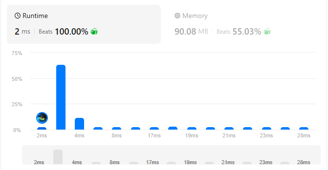

# LeetCode 1855 — Maximum Distance Between a Pair of Values

Problem: You're given two non-increasing 0-indexed integer arrays `nums1` and `nums2`.

A pair of indices `(i, j)` (where `0 <= i < nums1.length` and `0 <= j < nums2.length`) is valid if both:
- `i <= j`, and
- `nums1[i] <= nums2[j]`.

The distance of a valid pair is `j - i`. Return the maximum distance among all valid pairs. If there are no valid pairs, return `0`.

An array `arr` is non-increasing if `arr[i-1] >= arr[i]` for every `1 <= i < arr.length`.

---

## Examples

Example 1

Input:
```
nums1 = [55, 30, 5, 4, 2]
nums2 = [100, 20, 10, 10, 5]
```
Output: `2`

Explanation: Valid pairs include `(0,0), (2,2), (2,3), (2,4), (3,3), (3,4), (4,4)`. The maximum distance is `2` using pair `(2,4)`.

Example 2

Input:
```
nums1 = [2, 2, 2]
nums2 = [10, 10, 1]
```
Output: `1`

Example 3

Input:
```
nums1 = [30, 29, 19, 5]
nums2 = [25, 25, 25, 25, 25]
```
Output: `2`

---

## Constraints

- `1 <= nums1.length, nums2.length <= 10^5`
- `1 <= nums1[i], nums2[j] <= 10^5`
- Both `nums1` and `nums2` are non-increasing.

---

## Approach (concise)

Because both arrays are non-increasing, we can use a two-pointer greedy method:

- Fix pointer `i` for `nums1` starting at `0` and pointer `j` for `nums2` starting at `0`.
- While `i < len(nums1)` and `j < len(nums2)`:
  - If `nums1[i] <= nums2[j]`, this pair is valid; update `ans = max(ans, j - i)` and advance `j` (to try for a larger distance).
  - Otherwise (`nums1[i] > nums2[j]`), advance `i` because no `j' >= j` will make `nums1[i] <= nums2[j']` true (arrays are non-increasing in value as index increases), so we need a smaller `nums1[i]` (i.e., larger `i`).

This runs in O(n + m) time and O(1) extra space.

Pseudocode:

```
i = 0; j = 0; ans = 0
while i < n and j < m:
    if nums1[i] <= nums2[j]:
        ans = max(ans, j - i)
        j += 1
    else:
        i += 1
return ans
```

---

## Complexity

- Time: O(n + m), where n = len(nums1), m = len(nums2)
- Space: O(1) extra space


## Submission summary

-
